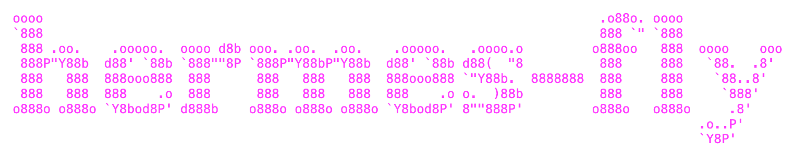

Deploy [Hermes](https://github.com/NousResearch/hermes-agent) to
[Fly.io](https://fly.io) with a single command.

Interactive CLI wizard that provisions, configures,
and manages a Hermes instance on Fly.io.

## Features

- **Deploy wizard** -- guided setup that provisions your app, volume, VM, and secrets
- **Status** -- check app health, machine state, region, and URL at a glance
- **Logs** -- stream or tail live application logs
- **Doctor** -- run diagnostic checks to verify connectivity, auth, and app health
- **Destroy** -- clean teardown of app, volumes, and local config
- **Messaging** -- optional Telegram and Discord notification setup

## Quick Start

### Install

```bash
curl -fsSL "https://raw.githubusercontent.com/alexfazio/hermes-fly/main/scripts/install.sh" | bash
```

Or clone and run directly:

```bash
git clone https://github.com/alexfazio/hermes-fly.git
cd hermes-fly
./hermes-fly deploy
```

### Deploy

```bash
hermes-fly deploy
```

The wizard walks you through:

1. Platform and prerequisite checks
2. Fly.io authentication
3. App name, region, VM size, and volume configuration
4. API key and model selection
5. Optional messaging setup (Telegram / Discord)
6. Build, deploy, and health verification

## Commands

| Command              | Description                              |
| -------------------- | ---------------------------------------- |
| `hermes-fly deploy`  | Launch the interactive deploy wizard     |
| `hermes-fly status`  | Show app status, machine state, and URL  |
| `hermes-fly logs`    | Stream live application logs             |
| `hermes-fly doctor`  | Run diagnostic checks on deployment      |
| `hermes-fly destroy` | Tear down app, volumes, and local config |

## Cost Estimates

Fly.io charges are usage-based. Typical monthly costs:

| VM Size        | Mem    | VM     | +1 GB  | +5 GB  | +10 GB |
| -------------- | ------ | ------ | ------ | ------ | ------ |
| shared-cpu-1x  | 256 MB | ~$1.94 | $2.09  | $2.69  | $3.44  |
| shared-cpu-2x  | 512 MB | ~$3.88 | $4.03  | $4.63  | $5.38  |
| performance-1x | 2 GB   | ~$12   | $12.15 | $12.75 | $13.50 |

Volume storage: $0.15/GB/month. See
[Fly.io Pricing](https://fly.io/pricing) for current rates.

## Prerequisites

- **flyctl** -- the
  [Fly.io CLI](https://fly.io/docs/flyctl/install/).
- **macOS or Linux** -- Windows is not supported.
- **A Fly.io account** -- sign up free at [fly.io](https://fly.io).
- **curl** and **git** -- standard on most systems.

## Security

Secrets (API keys, bot tokens) are stored via
`fly secrets set` and never written to disk. They
are injected as environment variables at runtime.
No secrets appear in fly.toml, Dockerfile, or
local config.

## License

[MIT](LICENSE)

## Documentation

See the [docs/](docs/) directory for detailed guides:

- [Getting Started](docs/getting-started.md) -- step-by-step deployment walkthrough
- [Messaging Setup](docs/messaging.md) -- Telegram and Discord configuration
- [Troubleshooting](docs/troubleshooting.md) -- common issues and fixes
