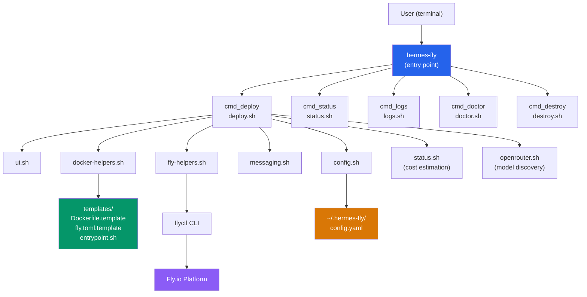
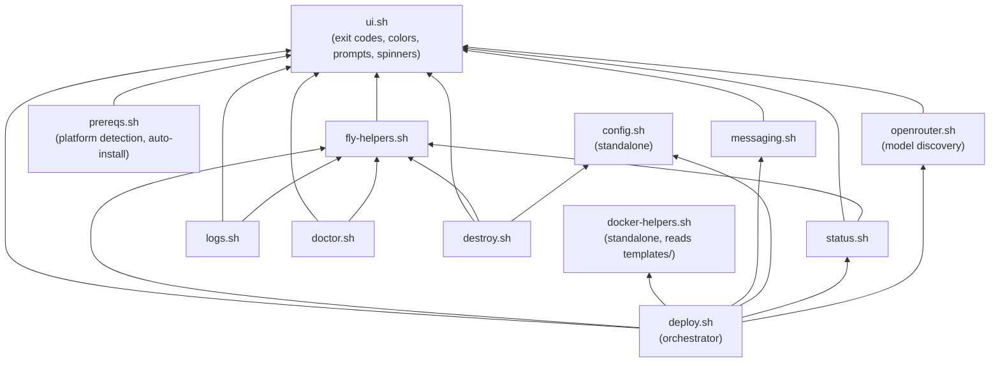

# hermes-fly Architecture Overview

Master navigation document for the hermes-fly Project Structure Files (PSF).

## 1. Project Identity

| Field | Value |
|-------|-------|
| **Name** | hermes-fly |
| **Version** | 0.1.14 |
| **Language** | Pure Bash (3.2+ compatible) |
| **Purpose** | CLI wizard to deploy [Hermes Agent](https://github.com/NousResearch/hermes-agent) to [Fly.io](https://fly.io) |
| **License** | MIT |
| **Repository** | `github.com/alexfazio/hermes-fly` |

## 2. System Architecture



## 3. Directory Structure

```text
hermes-fly/
├── hermes-fly                  # Entry point: arg parsing + command dispatch
├── lib/                        # Core library modules (13 files)
│   ├── ui.sh                   # Colors, prompts, spinners, logging, exit codes
│   ├── prereqs.sh              # Prerequisite detection + auto-install with fallbacks
│   ├── config.sh               # App tracking (~/.hermes-fly/config.yaml)
│   ├── fly-helpers.sh          # Fly.io CLI wrappers + retry logic
│   ├── docker-helpers.sh       # Template-based Dockerfile/fly.toml generation
│   ├── messaging.sh            # Telegram setup wizard
│   ├── openrouter.sh           # OpenRouter model discovery + provider-first picker
│   ├── deploy.sh               # Interactive deployment wizard (orchestrator)
│   ├── status.sh               # Status display + cost estimation
│   ├── logs.sh                 # Log streaming wrapper
│   ├── doctor.sh               # Diagnostic health checks
│   ├── destroy.sh              # Teardown + cleanup
│   └── list.sh                 # List deployed Hermes instances
├── templates/                  # Deployment artifact templates
│   ├── Dockerfile.template     # Python 3.11 + Hermes Agent install
│   ├── fly.toml.template       # Fly.io app configuration
│   └── entrypoint.sh           # Container startup: symlinks, secrets bridge, gateway
├── scripts/
│   └── install.sh              # curl | bash installer
├── tests/                      # BATS test suite (17 test files + mocks)
│   ├── *.bats                  # Test files per module
│   ├── bats/                   # BATS framework
│   ├── mocks/                  # Mock executables (apt-get, brew, curl, fly, git, mock-fail-gracefully, sudo, xcode-select)
│   └── test_helper/            # Shared test utilities
├── docs/                       # Documentation
│   ├── psf/                    # Project Structure Files (this directory)
│   ├── plans/                  # Future roadmap
│   ├── EDGE_CASE_HANDLING.md   # Edge case scenarios in prereqs module
│   ├── architecture.md         # System design overview
│   ├── getting-started.md      # Deployment walkthrough
│   ├── configuration.md        # Config options
│   ├── messaging.md            # Telegram/Discord setup
│   ├── troubleshooting.md      # Common issues
│   └── uninstall.md            # Removal instructions
├── README.md
└── LICENSE
```

## 4. Module Dependency Graph



All modules are sourced by the entry point `hermes-fly` at startup. Dependencies between modules use guard clauses to prevent re-sourcing (checking whether key functions or variables are already defined).

## 5. Key Design Decisions

| Decision | Rationale |
|----------|-----------|
| **Pure Bash** | No compilation, easy to audit, single-file distribution possible |
| **Modular `lib/` structure** | Separation of concerns, testable units |
| **Template-based artifact generation** | Readable templates vs. embedded heredocs in Bash |
| **Secrets via Fly.io only** | Never stored locally; injected as env vars at runtime |
| **`set -euo pipefail`** | Fail-fast on any unhandled error |
| **No `jq` dependency** | Fallback to grep/sed for JSON parsing; jq used opportunistically in doctor.sh |
| **Exponential backoff retry** | Handles transient Fly.io API failures gracefully |
| **Interactive prompts with defaults** | User-friendly but scriptable via env var overrides |

## 6. Core Workflows

### Deploy Flow

```text
hermes-fly deploy
  → deploy_preflight()        # Platform, flyctl, auth, connectivity
  → deploy_collect_config()   # App name, org, region, VM, volume, LLM, messaging
  → deploy_create_build_context()  # Generate Dockerfile + fly.toml from templates
  → deploy_provision_resources()   # fly apps create, volumes create, secrets set
  → deploy_run_deploy()       # fly deploy (builds Docker image, starts machine)
  → deploy_post_deploy_check()    # Verify machine running + HTTP probe
  → deploy_show_success()     # Summary with URL, cost estimate, next steps
  → config_save_app()         # Persist to ~/.hermes-fly/config.yaml
```

### Management Commands

| Command | Module | Fly CLI calls |
|---------|--------|---------------|
| `status` | `status.sh` | `fly status --json` |
| `logs` | `logs.sh` | `fly logs` |
| `doctor` | `doctor.sh` | `fly status`, `fly volumes list`, `fly secrets list`, `curl` |
| `destroy` | `destroy.sh` | `fly volumes list/delete`, `fly apps destroy` |

## 7. PSF Document Index

| Document | Scope |
|----------|-------|
| **[00-hermes-fly-architecture-overview.md](00-hermes-fly-architecture-overview.md)** | This file: navigation, architecture, design decisions |
| **[01-cli-entry-and-dispatch.md](01-cli-entry-and-dispatch.md)** | Entry point, command routing, argument parsing |
| **[02-prerequisite-system.md](02-prerequisite-system.md)** | Prerequisite detection, auto-install logic, platform-specific fallbacks |
| **[03-infrastructure-and-operations.md](03-infrastructure-and-operations.md)** | Fly.io helpers, status, logs, doctor, destroy commands |
| **[04-ui-config-messaging.md](04-ui-config-messaging.md)** | UI primitives, config management, messaging setup |
| **[05-testing-and-qa.md](05-testing-and-qa.md)** | BATS test framework, test organization, mocking, CI/CD integration |
| **[06-debugging.md](06-debugging.md)** | Debugging strategies, log analysis, common failures, troubleshooting |
| **[07-deployment.md](07-deployment.md)** | Complete deploy wizard, template system, resource provisioning, post-deploy ops |
| **[08-maintainability.md](08-maintainability.md)** | Code conventions, extension patterns, dependency management, versioning |
| **[09-security.md](09-security.md)** | Secret management, input validation, container isolation, trust boundaries |

## 8. External Dependencies

| Dependency | Required | Purpose |
|------------|----------|---------|
| `bash` 3.2+ | Yes | Runtime |
| `flyctl` (fly CLI) >= 0.2.0 | Yes | All Fly.io operations |
| `git` | Yes | Version detection, install |
| `curl` | Yes | Connectivity checks, health probes |
| `sed`, `grep` | Yes | JSON parsing, template substitution |
| `jq` | No (optional) | JSON parsing in doctor.sh (falls back to grep/sed) |

## 9. Runtime Data

| Location | Contents | Sensitive |
|----------|----------|-----------|
| `~/.hermes-fly/config.yaml` | App names, regions, timestamps | No |
| `~/.hermes-fly/hermes-fly.log` | Operation log | No |
| Fly.io secrets (remote) | API keys, bot tokens | Yes |
| `/root/.hermes` (container) | Hermes runtime data, volume mount | Partially |
