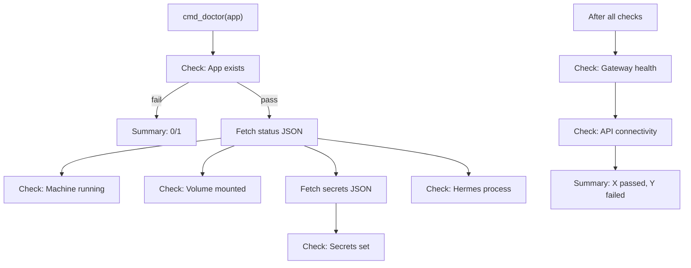

# Infrastructure and Operations

PSF for the Fly.io helper layer and management commands (status, logs, doctor, destroy).

**Related PSFs**: [00-architecture](00-hermes-fly-architecture-overview.md) | [07-deployment](07-deployment.md) | [04-ui-config-messaging](04-ui-config-messaging.md)

## 1. Scope

This document covers the infrastructure abstraction layer and all post-deploy management commands:

| Path | Lines | Role |
|------|-------|------|
| `lib/fly-helpers.sh` | ~293 | Fly.io CLI wrappers + retry |
| `lib/status.sh` | ~91 | Status display + cost estimation |
| `lib/logs.sh` | ~33 | Log streaming wrapper |
| `lib/doctor.sh` | ~254 | Diagnostic health checks |
| `lib/destroy.sh` | ~163 | Teardown + cleanup |

## 2. Fly Helpers (`lib/fly-helpers.sh`)

The central abstraction layer between hermes-fly and the `flyctl` CLI. Every Fly.io API interaction goes through this module.

### 2.1 Prerequisite Checks

| Function | Purpose | Return |
|----------|---------|--------|
| `fly_check_installed()` | `command -v fly` | 0/1 |
| `fly_check_version()` | Parse `fly version` output, require >= 0.2.0 | 0/1 |
| `fly_check_auth()` | `fly auth whoami` | 0/EXIT_AUTH(2) |
| `fly_auth_login_command()` | Resolve safest `fly auth login` command path (prefers `~/.fly/bin/fly`) | Echoes command string |
| `fly_check_auth_interactive()` | Check auth, prompt for login + retry once | 0/EXIT_AUTH(2) |

Version parsing: extracts `X.Y.Z` from `fly vX.Y.Z ...` via sed, splits on `.`, compares major > 0 OR (major == 0 AND minor >= 2).

### 2.2 Resource Operations

| Function | Fly CLI command | Notes |
|----------|----------------|-------|
| `fly_create_app "name" ["org"]` | `fly apps create NAME [--org ORG] --json` | Optional org parameter |
| `fly_destroy_app "name"` | `fly apps destroy NAME --yes` | Non-interactive |
| `fly_create_volume "app" "name" "size" "region"` | `fly volumes create ... --json --yes` | |
| `fly_list_volumes "app"` | `fly volumes list --app APP --json` | Returns JSON |
| `fly_delete_volume "id"` | `fly volumes delete ID --yes` | By volume ID |
| `fly_set_secrets "app" KEY=VAL...` | `fly secrets set ... --app APP` | Variadic |
| `fly_deploy "app" "dir" ["timeout"]` | `cd dir && fly deploy --app APP --wait-timeout T` | Default 5m0s |
| `fly_status "app"` | `fly status --app APP --json` | Returns JSON |
| `fly_logs "app" [args...]` | `fly logs --app APP [args]` | Passes extra args |

### 2.3 Platform Queries

| Function | Fly CLI command |
|----------|----------------|
| `fly_get_regions()` | `fly platform regions --json` |
| `fly_get_vm_sizes()` | `fly platform vm-sizes --json` |
| `fly_get_orgs()` | `fly orgs list --json` |

### 2.4 Machine State

`fly_get_machine_state("app")` parses the first `"state"` field from `fly_status` JSON output. Returns the state string (e.g., `started`, `stopped`) via stdout. Returns 1 and echoes `unknown` on failure.

### 2.5 Retry Logic

```bash
fly_retry "max_attempts" CMD...
```

- Executes command, returns 0 on success
- On failure: sleeps with exponential backoff (1s, 2s, 4s, ...)
- After `max_attempts`: prints error message to stderr, returns 1
- `HERMES_FLY_RETRY_SLEEP=0` disables sleep (for tests)

## 3. Status Command (`lib/status.sh`)

### 3.1 `cmd_status "app_name"`

Fetches `fly status --json` and parses 4 fields using sed (no jq dependency):

| Field | JSON path | Display |
|-------|-----------|---------|
| App name | `"name":"..."` | `App: name` |
| Status | `"status":"..."` | `Status: deployed` |
| Machine state | `"state":"..."` | `Machine: started` |
| Region | `"region":"..."` | `Region: iad` |
| Hostname | `"hostname":"..."` | `URL: https://hostname` |

### 3.2 `status_estimate_cost "vm_size" "volume_gb"`

Integer-cent arithmetic to avoid floating-point in Bash:

| VM Size | Base cost (cents) |
|---------|------------------|
| shared-cpu-1x | 194 ($1.94) |
| shared-cpu-2x | 388 ($3.88) |
| performance-1x | 1200 ($12.00) |
| dedicated-cpu-1x | 2300 ($23.00) |

Volume cost: `volume_gb * 15` cents ($0.15/GB/month).

Output format: `~$X.XX/mo`

## 4. Logs Command (`lib/logs.sh`)

Minimal wrapper around `fly_logs`. The entire module delegates to `fly-helpers.sh` with UI error handling. Additional arguments are passed through to `fly logs`.

## 5. Doctor Command (`lib/doctor.sh`)

### 5.1 Check Functions

| Check | Function | Method | Pass condition |
|-------|----------|--------|----------------|
| App exists | `doctor_check_app_exists` | `fly_status` | Command succeeds |
| Machine running | `doctor_check_machine_running` | Parse status JSON | state = "started" or "running" |
| Volume mounted | `doctor_check_volume_mounted` | `fly_list_volumes` | Non-empty JSON array |
| Secrets set | `doctor_check_secrets_set` | `fly secrets list --json` | Contains any of: OPENROUTER_API_KEY, NOUS_API_KEY, LLM_API_KEY |
| Hermes process | `doctor_check_hermes_process` | Grep status JSON | `"process"` contains `"hermes"` |
| Gateway health | `doctor_check_gateway_health` | `curl https://{app}.fly.dev` | HTTP response within 10s |
| API connectivity | `doctor_check_api_connectivity` | `curl` to provider endpoint | HTTP response within 5s |

### 5.2 JSON Parsing Strategy

`doctor_check_machine_running` uses jq if available, falls back to grep/sed:

```bash
if command -v jq &>/dev/null; then
  state="$(... | jq -r '.machines[0].state // empty')"
else
  state="$(... | tr -d '\n' | grep -oE '"state"..."' | head -1 | sed ...)"
fi
```

This is the only module that uses jq opportunistically.

### 5.3 Report Format

```text
[PASS] check_name: message    → stdout
[FAIL] check_name: message    → stderr
```

Each FAIL message includes an actionable fix command (e.g., `fly machine start -a APP`).

### 5.4 Execution Flow



If the app doesn't exist, remaining checks are skipped (they'd all fail meaninglessly).

Return: 0 if all pass, 1 if any fail.

## 6. Destroy Command (`lib/destroy.sh`)

### 6.1 `cmd_destroy "app_name" [--force]`

1. Parse args for `--force` flag
2. If no app name provided: interactive selection from `config_list_apps`
3. Without `--force`: prompt user to type "yes" to confirm (not `ui_confirm` — requires exact "yes" string)
4. `destroy_telegram_logout`: disconnect Telegram bot (fail-open)
5. `destroy_cleanup_volumes`: list volumes via `fly_list_volumes`, parse IDs matching `vol_*`, delete each
6. `fly_destroy_app`: destroys the Fly.io app (`--yes` flag)
7. `destroy_remove_config` → `config_remove_app`: removes from `~/.hermes-fly/config.yaml`

### 6.2 `destroy_telegram_logout "app_name"`

Disconnects the Telegram bot before app destruction:

1. Checks machine state via `fly_get_machine_state` — if stopped/unknown, prints manual steps and returns
2. If machine running: runs `curl` commands via `fly ssh console` to call Telegram `logOut` and `deleteWebhook` APIs
3. On success: warns user to wait 10 minutes before reusing the bot token
4. On failure: prints manual steps (revoke token via @BotFather, revoke OpenRouter key)

Fail-open design: errors are non-fatal (`|| true` in `cmd_destroy`).

### 6.3 Failure Handling

- If app not found during destroy: `EXIT_RESOURCE` (4)
- Telegram logout errors are non-fatal (fail-open)
- Volume deletion errors are non-fatal (volumes may already be detached)
- Config cleanup runs regardless of app destroy result

## 7. JSON Parsing Patterns

Since hermes-fly avoids a hard jq dependency, JSON parsing uses consistent patterns:

**Extract field value from flat JSON:**
```bash
echo "$json" | sed -n 's/.*"field"[[:space:]]*:[[:space:]]*"\([^"]*\)".*/\1/p' | head -1
```

**Extract field from collapsed JSON:**
```bash
printf '%s' "$json" | tr -d '\n' | grep -oE '"field"[[:space:]]*:[[:space:]]*"[^"]*"' | head -1 | sed 's/.*"\([^"]*\)"$/\1/'
```

**Check for field existence:**
```bash
printf '%s' "$json" | grep -qE '"field_name"'
```

**Extract list of values:**
```bash
echo "$json" | grep -oE '"field"\s*:\s*"[^"]*"' | sed 's/.*"\([^"]*\)"$/\1/'
```

## 8. Error Propagation

All commands follow the same pattern:

1. Resolve app name (fail with actionable message if missing)
2. Call Fly.io API (propagate failure via `set -e`)
3. Display formatted results or error message
4. Return 0 on success, 1+ on failure

Exit codes are standardized across all commands via `ui.sh` constants:

| Code | Constant | Meaning |
|------|----------|---------|
| 0 | `EXIT_SUCCESS` | All operations succeeded |
| 1 | `EXIT_ERROR` | General error |
| 2 | `EXIT_AUTH` | Authentication failure |
| 3 | `EXIT_NETWORK` | Network connectivity failure |
| 4 | `EXIT_RESOURCE` | Resource not found / limit hit |
