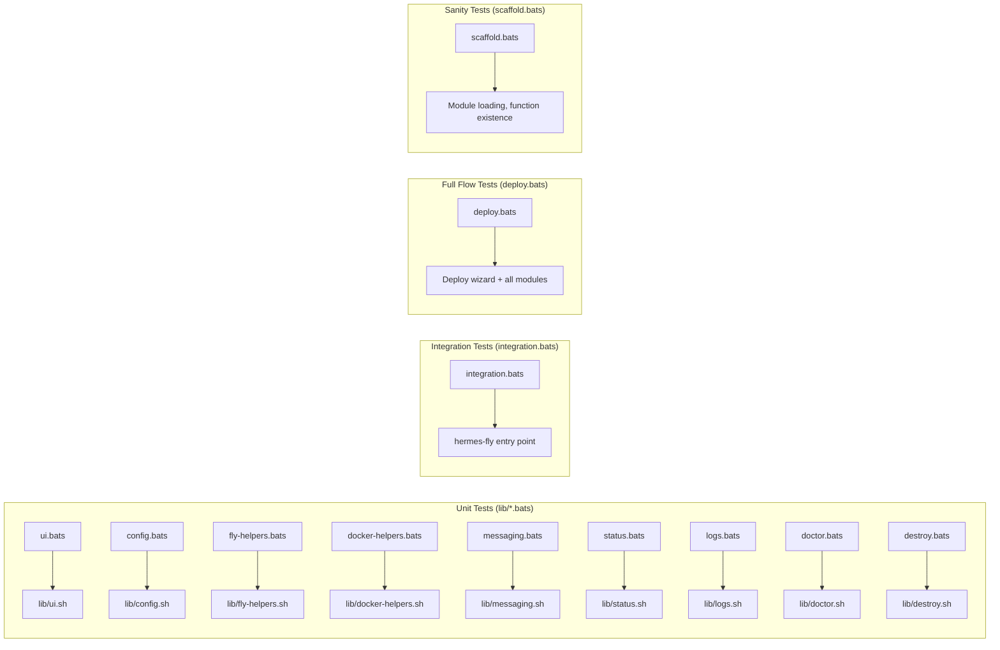

# Testing and Quality Assurance

PSF for the BATS test framework, test organization, mocking strategy, coverage, and quality standards.

**Related PSFs**: [00-architecture](00-hermes-fly-architecture-overview.md) | [07-deployment](07-deployment.md) | [06-debugging](06-debugging.md) | [08-maintainability](08-maintainability.md)

## 1. Scope

Comprehensive coverage of hermes-fly's testing infrastructure:

| Path | Contents |
|------|----------|
| `tests/` | Root test directory with all test files and helpers |
| `tests/*.bats` | 14 test files (one per module + integration/scaffold) |
| `tests/bats/` | BATS framework (vendored, self-contained) |
| `tests/mocks/` | Mock executables for `fly` CLI and dependencies |
| `tests/test_helper/` | Shared test utilities and setup functions |

## 2. Testing Framework: BATS

[BATS](https://github.com/bats-core/bats-core) (Bash Automated Testing System) is a TAP-compliant (Test Anything Protocol) test framework designed for Bash scripts. It provides:

- **TAP output**: Standard format for test result reporting
- **Setup/teardown hooks**: Per-test initialization and cleanup
- **Assertion functions**: `run` command captures output and exit codes
- **Parallel execution**: Tests can run concurrently for speed

### Basic Structure

```bash
#!/usr/bin/env bats

# Optional: runs before each test
setup() {
  export TEST_VAR="value"
  mkdir -p "${TEST_DIR}"
}

# Optional: runs after each test
teardown() {
  rm -rf "${TEST_DIR}"
}

# Test case: name describes behavior
@test "function_name: does expected thing with specific input" {
  # Call the function
  run some_function "arg1" "arg2"

  # Assert exit code
  [ "$status" -eq 0 ]

  # Assert output
  [ "$output" = "expected output" ]
  [[ "$output" == *"substring"* ]]
  [[ "$output" =~ "regex.*pattern" ]]
}
```

### Running Tests

```bash
# Run all tests in directory
./tests/bats/bin/bats tests/

# Run specific test file
./tests/bats/bin/bats tests/config.bats

# Run tests matching name pattern
./tests/bats/bin/bats tests/ --filter "config"

# Verbose TAP output
./tests/bats/bin/bats tests/ --tap

# Parallel execution (faster)
./tests/bats/bin/bats tests/ -j 4
```

## 3. Test File Organization

### 3.1 Unit Test Files

Each module has a dedicated test file. Tests are isolated and can source the module independently.

| File | Module tested | Tests | Focus |
|------|---------------|-------|-------|
| `ui.bats` | `lib/ui.sh` | 12+ | Colors, prompts, spinners, exit codes, logging |
| `config.bats` | `lib/config.sh` | 10+ | Save/load/remove apps, config YAML parsing, validation |
| `fly-helpers.bats` | `lib/fly-helpers.sh` | 8+ | CLI wrappers, version checks, retry logic |
| `docker-helpers.bats` | `lib/docker-helpers.sh` | 6+ | Template generation, file writes, validation |
| `messaging.bats` | `lib/messaging.sh` | 12+ | Token validation, user ID parsing, setup flows |
| `status.bats` | `lib/status.sh` | 4+ | Cost estimation arithmetic, display formatting |
| `logs.bats` | `lib/logs.sh` | 2+ | Log wrapper, error handling |
| `doctor.bats` | `lib/doctor.sh` | 12+ | Individual checks, JSON parsing, report formatting |
| `destroy.bats` | `lib/destroy.sh` | 6+ | Confirmation, volume cleanup, app teardown |

### 3.2 Integration Test Files

Higher-level tests that verify interactions between modules and end-to-end behavior.

| File | Scope | Tests |
|------|-------|-------|
| `deploy.bats` | `lib/deploy.sh` orchestration | 25+ |
| `scaffold.bats` | All modules load without error | 5+ |
| `integration.bats` | CLI entry point (`hermes-fly`) | 8+ |

## 4. Mocking Strategy

### 4.1 Mock `fly` CLI

Tests must not call the real Fly.io API. Instead, mock `fly` executables provide canned responses.

**Mock setup:**

```text
tests/mocks/
├── fly              # Default mock: echoes args or returns JSON
└── fly-fail         # Failure variant: returns non-zero exit codes
```

**Injection method:**

```bash
setup() {
  # Prepend mocks to PATH — test `fly` calls hit our mock first
  export PATH="${BATS_TEST_DIRNAME}/mocks:$PATH"
}
```

**Example mock (`tests/mocks/fly`):**

```bash
#!/bin/bash
# Simple mock: echo command + args for debugging
case "$1" in
  version)
    echo "fly version v0.2.5"
    ;;
  auth)
    case "$2" in
      whoami) echo "user@example.com" ;;
      *) return 1 ;;
    esac
    ;;
  apps)
    case "$2" in
      create) echo '{"id":"app123","name":"test-app"}' ;;
      *) return 1 ;;
    esac
    ;;
  *)
    return 1
    ;;
esac
```

### 4.2 Function Mocking

For granular control, tests can redefine functions after sourcing a module:

```bash
setup() {
  source lib/deploy.sh

  # Mock the fly helper to always succeed
  fly_create_app() {
    echo '{"id":"test"}' # Canned response
    return 0
  }

  # Mock config operations
  config_save_app() {
    echo "mock: saving app $1"
    return 0
  }
}
```

This approach is used when module-under-test needs specific behavior from dependencies.

### 4.3 Environment Variable Isolation

Tests use environment variables to customize behavior without modifying real files:

| Variable | Purpose |
|----------|---------|
| `HERMES_FLY_RETRY_SLEEP=0` | Disable sleep in retry loops (test speed) |
| `HERMES_FLY_PLATFORM=Linux` | Force platform detection result |
| `HERMES_FLY_CONFIG_DIR=$(mktemp -d)` | Isolated config directory per test |
| `HERMES_FLY_LOG_DIR=$(mktemp -d)` | Isolated log directory per test |
| `NO_COLOR=1` | Disable colors for predictable text matching |
| `HERMES_FLY_TEST_MODE=1` | Skip `~/.fly/bin` file-path fallback in `_prereqs_check_tool_available` |
| `HERMES_FLY_NO_AUTO_INSTALL=1` | Disable auto-install prompts (non-interactive CI mode) |
| `HERMES_FLY_FLYCTL_INSTALL_CMD=...` | Override flyctl install command for custom install testing |
| `HERMES_FLY_VERBOSE=1` | Stream install output directly instead of capturing |

Example cleanup:

```bash
setup() {
  export HERMES_FLY_CONFIG_DIR="$(mktemp -d)"
}

teardown() {
  rm -rf "$HERMES_FLY_CONFIG_DIR"
}
```

## 5. Assertion Patterns

### 5.1 Exit Code Assertions

```bash
# Exact match
[ "$status" -eq 0 ]
[ "$status" -eq 1 ]

# Non-zero (failure)
[ "$status" -ne 0 ]
```

### 5.2 Output Assertions

```bash
# Exact string match
[ "$output" = "expected output" ]

# Substring (case-insensitive glob)
[[ "$output" == *"substring"* ]]

# Regex pattern
[[ "$output" =~ ^prefix.*suffix$ ]]

# Multi-line: check specific line
[ "${lines[0]}" = "first line" ]
[ "${lines[1]}" = "second line" ]

# Empty output
[ -z "$output" ]

# Output contains word
grep -q "word" <<<"$output"
```

### 5.3 File Assertions

```bash
# File exists
[ -f "$file" ]

# File is directory
[ -d "$dir" ]

# File contains text
grep -q "pattern" "$file"

# File permissions
[ -r "$file" ]  # readable
[ -w "$file" ]  # writable
[ -x "$file" ]  # executable
```

## 6. Test Categories and Coverage

### 6.1 Unit Tests (Function-level)

Test individual functions in isolation with mocked dependencies:

- **Input validation**: Valid/invalid inputs, boundary cases
- **Output format**: Correct structure, field order, content
- **Error handling**: Exit codes, error messages
- **Configuration**: Defaults, overrides, validation

Example (`config.bats`):

```bash
@test "config_save_app: saves app name and region to YAML" {
  run config_save_app "my-app" "iad"
  [ "$status" -eq 0 ]
  [ -f "$HERMES_FLY_CONFIG_DIR/config.yaml" ]
  grep -q "my-app" "$HERMES_FLY_CONFIG_DIR/config.yaml"
}

@test "config_save_app: overwrites existing app entry" {
  config_save_app "my-app" "iad"
  config_save_app "my-app" "fra"
  [ "$(grep -c 'name: my-app' "$HERMES_FLY_CONFIG_DIR/config.yaml")" -eq 1 ]
}
```

### 6.2 Integration Tests (Module interactions)

Test workflows across multiple modules:

- **Deploy wizard**: Full flow from preflight to success/failure
- **Management commands**: status → doctor → logs → destroy chain
- **CLI routing**: Entry point dispatching to correct command

Example (`integration.bats`):

```bash
@test "hermes-fly help: shows command list" {
  run ./hermes-fly help
  [ "$status" -eq 0 ]
  [[ "$output" == *"Commands:"* ]]
  [[ "$output" == *"deploy"* ]]
  [[ "$output" == *"status"* ]]
}

@test "hermes-fly deploy: with mocked Fly.io, completes successfully" {
  export PATH="${BATS_TEST_DIRNAME}/mocks:$PATH"
  run ./hermes-fly deploy << EOF
test-app
1
1
1
1
3
1
EOF
  [ "$status" -eq 0 ]
  [[ "$output" == *"Deployment Successful"* ]]
}
```

### 6.3 Coverage Map



## 7. Test Development Workflow

### 7.1 Adding Tests for New Code

When adding a new function or module:

1. Create `tests/newfeature.bats` with basic structure:

```bash
#!/usr/bin/env bats

setup() {
  source lib/newfeature.sh
  export HERMES_FLY_CONFIG_DIR="$(mktemp -d)"
}

teardown() {
  rm -rf "$HERMES_FLY_CONFIG_DIR"
}

@test "new_function: basic behavior" {
  run new_function "test_input"
  [ "$status" -eq 0 ]
}
```

2. Add tests for:
   - Valid inputs (happy path)
   - Invalid inputs (error cases)
   - Edge cases (empty, very large, special chars)
   - Mocked dependencies (if module calls fly, config, etc.)

3. Run: `./tests/bats/bin/bats tests/newfeature.bats`

4. Commit tests with code (same commit or PR)

### 7.2 Test-Driven Development (TDD)

The hermes-fly test suite supports TDD:

1. Write test for desired behavior (fails initially)
2. Implement minimal code to pass test
3. Refactor with confidence that tests prevent regressions

Example:

```bash
# Test first (fails before implementation)
@test "new_command: validates app name" {
  run new_command "invalid.app"
  [ "$status" -eq 1 ]
  [[ "$output" == *"invalid"* ]]
}

# Implementation (satisfies test)
new_command() {
  local app="$1"
  if [[ ! "$app" =~ ^[a-z0-9-]+$ ]]; then
    echo "Error: invalid app name"
    return 1
  fi
  # ... rest of implementation
}
```

## 8. CI/CD Integration

Tests are designed to run in CI without special setup:

```bash
# In CI configuration (e.g., GitHub Actions):
- name: Run tests
  run: ./tests/bats/bin/bats tests/

# Key properties for CI:
# - No real API calls (mocked)
# - No network dependency
# - No sensitive credentials needed
# - All temp files cleaned up
# - Deterministic results (no flakes)
```

## 9. Debugging Failed Tests

### 9.1 Run Single Test

```bash
./tests/bats/bin/bats tests/config.bats --filter "saves app"
```

### 9.2 Verbose Output

Add `set -x` to test to see execution:

```bash
@test "debug test" {
  set -x  # Show each command
  run some_function
  set +x
  [ "$status" -eq 0 ]
}
```

### 9.3 Inspect Mock Responses

Modify mock temporarily to log calls:

```bash
# tests/mocks/fly (debug version)
echo "DEBUG: fly $@" >> /tmp/fly_calls.log
# ... existing mock logic
```

Then check `/tmp/fly_calls.log` after test runs.

### 9.4 Manual Function Testing

Source module and test interactively:

```bash
bash$ source lib/config.sh
bash$ export HERMES_FLY_CONFIG_DIR="/tmp/test"
bash$ config_save_app "test" "iad"
bash$ cat /tmp/test/config.yaml
```

## 10. Best Practices

1. **Isolation**: Each test is independent (no shared state)
2. **Clarity**: Test names describe expected behavior clearly
3. **Mocking**: Never call real external services (APIs, filesystems beyond /tmp)
4. **Cleanup**: teardown() removes all side effects
5. **Coverage**: Unit tests for individual functions, integration tests for workflows
6. **Speed**: Tests complete in seconds (mocked fast)
7. **Determinism**: Same test always produces same result (no flakes)
8. **Maintenance**: Update tests when requirements change; don't delete old tests
