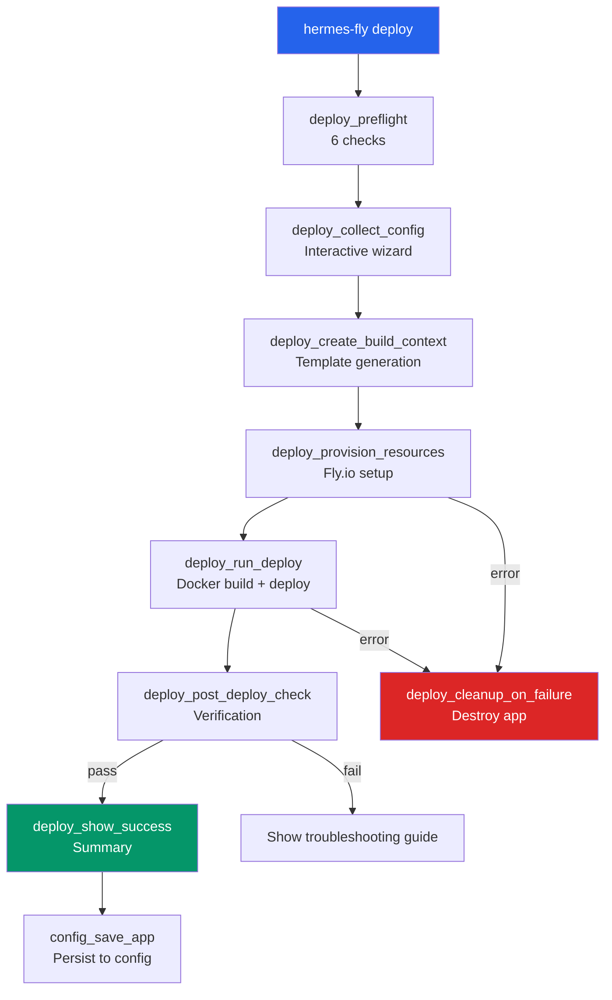

# Deployment Pipeline and Operations

PSF for the complete deployment workflow, resource provisioning, post-deployment operations, and troubleshooting.

**Related PSFs**: [00-architecture](00-hermes-fly-architecture-overview.md) | [04-ui-config-messaging](04-ui-config-messaging.md) | [03-infrastructure-and-operations](03-infrastructure-and-operations.md) | [05-testing-and-qa](05-testing-and-qa.md) | [06-debugging](06-debugging.md)

## 1. Scope

Complete documentation of the deployment system and post-deploy operations:

| Component | Responsibility |
|-----------|-----------------|
| **Deploy wizard** | Interactive configuration collection and resource provisioning |
| **Template system** | Dockerfile, fly.toml, and entrypoint generation |
| **Resource provisioning** | Fly.io app creation, volume management, secret configuration |
| **Deployment execution** | Docker build, image deployment, health verification |
| **Post-deploy operations** | Status monitoring, log streaming, diagnostics, teardown |

## 2. Deployment Architecture



## 3. Phase 1: Preflight Checks

`deploy_preflight()` validates the deployment environment before collecting configuration. All 6 checks must pass; stops at first failure.

### Check Details

| # | Check | Function | Validates | Exit on fail |
|---|-------|----------|-----------|--------------|
| 1 | Platform | `deploy_check_platform()` | OS is macOS (Darwin) or Linux | 1 |
| 2 | Prerequisites | `deploy_check_prerequisites()` | `fly`, `git`, `curl` on PATH | 1 |
| 3 | Flyctl installed | `fly_check_installed()` | `fly` command exists | 1 |
| 4 | Flyctl version | `fly_check_version()` | flyctl >= 0.2.0 | 1 |
| 5 | Fly.io auth | `fly_check_auth_interactive()` | `fly auth whoami` succeeds | 2 (EXIT_AUTH) |
| 6 | Network | `deploy_check_connectivity()` | `curl fly.io` responds | 3 (EXIT_NETWORK) |

### Display Modes

**Default mode** (spinner):
- Animated braille spinner with progressive status updates
- One-line output per phase
- Suitable for interactive terminals

**Verbose mode** (`HERMES_FLY_VERBOSE=1`):
- Step-by-step numbered output
- Full error messages shown
- Suitable for CI/CD and debugging

### Auth Recovery

If auth check fails, interactive recovery allows one retry:

```text
Error: Not authenticated with Fly.io
Press Enter when ready to retry... (60 second timeout)
  → User runs `fly auth login` in another terminal
  → Presses Enter
  → Auth check retries
  → Succeeds or fails permanently (EXIT_AUTH)
```

## 4. Phase 2: Configuration Collection

`deploy_collect_config()` interactively collects all deployment parameters. Each collector presents options and stores results in exported `DEPLOY_*` globals.

### 4.1 Organization Selection

```
deploy_collect_org() → fly orgs list --json
  ├─ Single org → auto-select silently
  ├─ Multiple orgs → ASCII table menu
  └─ Stores in: DEPLOY_ORG
```

### 4.2 App Name

```
deploy_collect_app_name() → user input with suggestion
  ├─ Default: hermes-{username}-{000-999}
  ├─ Validate: 2-63 chars, lowercase, starts with letter
  ├─ Check availability: fly apps create (may create during collection)
  ├─ Sets: DEPLOY_APP_CREATED=1 if created early
  └─ Stores in: DEPLOY_APP_NAME
```

**Retry on duplicate:**
```bash
fly apps create "test-app"
# Error: app already exists
# → Prompt user: "Try another name"
# → Loop back to input
```

### 4.3 Region Selection

```
deploy_collect_region() → fly platform regions --json
  ├─ Fallback: Static list of 10 popular regions (on API failure)
  ├─ Group: By continent (Americas, Europe, Asia-Pacific, etc.)
  ├─ Display: ASCII table with 50-line region list
  └─ Stores in: DEPLOY_REGION
```

### 4.4 VM Size Selection

```
deploy_collect_vm_size() → fly platform vm-sizes --json
  ├─ Offer: 4 standard sizes (shared-cpu-1x, shared-cpu-2x, performance-1x, performance-2x)
  ├─ Default: shared-cpu-2x (recommended)
  ├─ Show: RAM, monthly cost, use case (lightweight, most users, multi-tool, workloads)
  ├─ Stores in: DEPLOY_VM_SIZE, DEPLOY_VM_MEMORY
  └─ Fallback: Static pricing if API fails
```

**Cost display:**
```text
┌───┬──────────────┬──────┬───────────┬──────────────────────┐
│ # │ VM Size      │ RAM  │ Cost/mo   │ Use Case             │
├───┼──────────────┼──────┼───────────┼──────────────────────┤
│ 1 │ shared-cpu-1x│ 256mb│ ~$1.94    │ lightweight testing  │
│ 2 │ shared-cpu-2x│ 512mb│ ~$3.88    │ recommended for most │
│ 3 │performance-1x│ 1gb  │ ~$12.00   │ multi-tool agents    │
│ 4 │dedicated-cpu │ 1gb  │ ~$23.00   │ sustained workloads  │
└───┴──────────────┴──────┴───────────┴──────────────────────┘
```

### 4.5 Volume Size

```
deploy_collect_volume_size()
  ├─ Options: 1 GB (light), 5 GB (recommended), 10 GB (heavy)
  ├─ Pricing: $0.15/GB/month
  ├─ Default: 5 GB
  └─ Stores in: DEPLOY_VOLUME_SIZE
```

### 4.6 LLM Provider Configuration

```
deploy_collect_llm_config() → 3-choice provider menu
  ├─ 1: OpenRouter (default)
  │   ├─ Prompt: API key (required)
  │   └─ Model selection: provider-first dynamic picker via openrouter_setup_with_models()
  │       ├─ Fetches /api/v1/models from OpenRouter API
  │       ├─ Shows curated provider list (9 providers) + alphabetical "Other" tier
  │       ├─ Shows top 15 most-recent models per provider with display names
  │       └─ Falls back to manual model ID entry on API failure
  │
  ├─ 2: Nous Portal
  │   ├─ Prompt: API key (required)
  │   └─ Model: Managed by portal (no selection here)
  │
  └─ 3: Custom endpoint
      ├─ Prompt: Base URL (required)
      └─ Prompt: API key (required)

  Stores in:
    - DEPLOY_LLM_PROVIDER (openrouter | nous | custom)
    - DEPLOY_API_KEY (provider's API key)
    - DEPLOY_MODEL (model ID for OpenRouter, empty for others)
    - DEPLOY_LLM_BASE_URL (custom provider only)
```

### 4.7 Messaging Setup (Optional)

```
messaging_setup_menu() → 2 choices
  ├─ 1: Telegram
  │   ├─ messaging_setup_telegram()
  │   ├─ Prompt: Bot token (secret input, verified via Telegram API)
  │   ├─ Access control: Only me / Specific people / Anyone
  │   ├─ Prompt: User IDs (comma-separated)
  │   └─ Prompt: Home channel (auto-suggested)
  │
  └─ 2: Skip (default)

  Stores in:
    - DEPLOY_TELEGRAM_BOT_TOKEN
    - DEPLOY_TELEGRAM_ALLOWED_USERS
    - DEPLOY_MESSAGING_PLATFORM
    - DEPLOY_GATEWAY_ALLOW_ALL_USERS (if "Anyone" selected)
    - DEPLOY_TELEGRAM_HOME_CHANNEL (if set)
```

### 4.8 Confirmation Summary

Before proceeding, user sees:

```text
--- Deployment Summary ---
  App name:    test-app
  Region:      iad
  VM size:     shared-cpu-2x / 512mb
  Volume:      5 GB
  Model:       anthropic/claude-sonnet-4
  Messaging:   Telegram (configured)

Proceed with deployment? [y/N]
```

Returns 1 (cancel) if user declines.

### 4.9 Configuration Helper Functions

The collection phase relies on several parsing and lookup helpers:

| Function | Purpose |
|----------|---------|
| `deploy_generate_app_name()` | Generates `hermes-{whoami}-{000-999}` suggestion |
| `deploy_parse_orgs(JSON)` | Parses org list (flat map or array format) into `_ORG_SLUGS[]` and `_ORG_NAMES[]` |
| `deploy_parse_regions(JSON)` | Parses region JSON into `_REGION_CODES[]` and `_REGION_NAMES[]` |
| `deploy_get_region_continent(CODE)` | Maps region code to continent name (Americas, Europe, Asia-Pacific, Oceania, South America, Africa) |
| `deploy_parse_vm_sizes(JSON)` | Parses VM sizes JSON into `_VM_NAMES[]`, `_VM_MEMORY[]`, `_VM_PRICES[]` |
| `deploy_get_vm_tier(NAME)` | Returns tier label (Starter, Standard, Pro, Power) |
| `deploy_get_vm_recommendation(NAME)` | Returns recommendation text for each VM tier |
| `_deploy_fallback_mem(NAME)` | Static fallback memory (MB) when API unavailable |
| `_deploy_fallback_price(NAME)` | Static fallback monthly price when API unavailable |
| `_deploy_lookup_vm(NAME, FIELD)` | Looks up `mem` or `price` from parsed `_VM_*` arrays |
| `deploy_collect_model(RESULT_VAR)` | Delegates to `openrouter_setup_with_models()` for provider-first dynamic selection; falls back to manual entry on API failure |
| `deploy_validate_openrouter_key(KEY)` | Validates key via OpenRouter `/api/v1/key` endpoint; warns on free tier with no usage |
| `deploy_validate_nous_key(KEY)` | Validates key via Nous API; hard-rejects 401/403, offers bypass on network/server errors |
| `deploy_write_summary()` | Writes YAML + Markdown deploy summary files to `~/.hermes-fly/deploys/` |

## 5. Phase 3: Build Context Generation

`deploy_create_build_context()` generates the three deployment artifacts from templates.

### 5.1 Artifact Generation

```bash
docker_get_build_dir()
  ├─ mktemp -d → ${build_dir}
  └─ Returns: path to temp directory

docker_generate_dockerfile()
  ├─ Read: templates/Dockerfile.template
  ├─ Substitute: {{HERMES_VERSION}} → "main"
  └─ Write: ${build_dir}/Dockerfile

docker_generate_fly_toml()
  ├─ Read: templates/fly.toml.template
  ├─ Substitute:
  │   {{APP_NAME}} → DEPLOY_APP_NAME
  │   {{REGION}} → DEPLOY_REGION
  │   {{VM_SIZE}} → DEPLOY_VM_SIZE
  │   {{VM_MEMORY}} → DEPLOY_VM_MEMORY
  │   {{VOLUME_NAME}} → "hermes_data"
  │   {{VOLUME_SIZE}} → DEPLOY_VOLUME_SIZE + "gb"
  └─ Write: ${build_dir}/fly.toml

docker_generate_entrypoint()
  ├─ Read: templates/entrypoint.sh
  └─ Copy: ${build_dir}/entrypoint.sh

Store in: DEPLOY_BUILD_DIR
```

### 5.2 Template Files

**Dockerfile.template (16 lines):**
```dockerfile
FROM python:3.11-slim
# Install apt packages: git, curl, xz-utils
# Download Hermes Agent install script from {{HERMES_VERSION}} git ref
# Install Hermes (--skip-setup): skips initial configuration
# Move binaries to /opt/hermes/ (survive volume mount at /root/.hermes)
# Copy default configs to /opt/hermes/defaults/
COPY entrypoint.sh /entrypoint.sh
ENTRYPOINT ["/entrypoint.sh"]
```

**fly.toml.template (21 lines):**
```toml
app = "{{APP_NAME}}"
primary_region = "{{REGION}}"

[build]

[env]

[http_service]
  internal_port = 8080
  auto_stop_machines = "off"
  auto_start_machines = true
  min_machines_running = 1

[[vm]]
  size = "{{VM_SIZE}}"
  memory = "{{VM_MEMORY}}"

[[mounts]]
  source = "{{VOLUME_NAME}}"
  destination = "/root/.hermes"
  initial_size = "{{VOLUME_SIZE}}"
```

**entrypoint.sh (105 lines):**

Runs on every container boot:

1. Symlink binaries from `/opt/hermes/` to `/root/.hermes/` (survives volume wipes)
2. Create runtime directories (cron, sessions, logs, pairing, hooks, image_cache, audio_cache, memories, whatsapp/session)
3. Seed default configs on first deploy (only if missing: `.env`, `config.yaml`, `SOUL.md`)
4. Seed skills directory on first deploy (copies `/opt/hermes/defaults/skills/` if missing)
5. Bridge Fly secrets to `/root/.hermes/.env` (every boot):
   - LLM: `OPENROUTER_API_KEY`, `LLM_MODEL`, `LLM_BASE_URL`, `LLM_API_KEY`, `NOUS_API_KEY`
   - Telegram: `TELEGRAM_BOT_TOKEN`, `TELEGRAM_ALLOWED_USERS`, `TELEGRAM_HOME_CHANNEL`
   - Discord (backward compat): `DISCORD_BOT_TOKEN`, `DISCORD_ALLOWED_USERS`
   - App identity: `HERMES_APP_NAME`, `GATEWAY_ALLOW_ALL_USERS`
6. Auto-configure Telegram bot description and short description via Telegram API (non-blocking, background subshell)
7. Patch `config.yaml` model from `LLM_MODEL` env var
8. Clear rate limit entries for already-approved users (Python script)
9. Pre-seed Telegram approved users on first boot (skip pairing prompt for configured users)
10. `exec` hermes gateway

## 6. Phase 4: Resource Provisioning

`deploy_provision_resources()` creates all Fly.io resources with retry logic.

### 6.1 Three-Step Process

```
Step 1: Create app (skip if DEPLOY_APP_CREATED=1)
  fly_retry 3 fly_create_app "${DEPLOY_APP_NAME}" "${DEPLOY_ORG}"
  └─ Retry: 1s, 2s, 4s backoff

Step 2: Create volume
  fly_retry 3 fly_create_volume "${DEPLOY_APP_NAME}" "hermes_data" \
    "${DEPLOY_VOLUME_SIZE}" "${DEPLOY_REGION}"
  └─ Retry: 1s, 2s, 4s backoff

Step 3: Set secrets
  fly_retry 3 fly_set_secrets "${DEPLOY_APP_NAME}" ${secrets[@]}
  └─ Retry: 1s, 2s, 4s backoff
```

### 6.2 Secret Mapping

Secrets depend on `DEPLOY_LLM_PROVIDER`:

**OpenRouter:**
```bash
OPENROUTER_API_KEY="${DEPLOY_API_KEY}"
LLM_MODEL="${DEPLOY_MODEL}"
```

**Nous Portal:**
```bash
NOUS_API_KEY="${DEPLOY_API_KEY}"
```

**Custom:**
```bash
LLM_BASE_URL="${DEPLOY_LLM_BASE_URL}"
LLM_API_KEY="${DEPLOY_API_KEY}"
```

**Always include app identity:**
```bash
HERMES_APP_NAME="${DEPLOY_APP_NAME}"
```

**Gateway config (if set):**
```bash
GATEWAY_ALLOW_ALL_USERS="${DEPLOY_GATEWAY_ALLOW_ALL_USERS}"  # only if "Anyone" mode
TELEGRAM_HOME_CHANNEL="${DEPLOY_TELEGRAM_HOME_CHANNEL}"      # only if set
```

**Telegram secrets (if configured):**
```bash
TELEGRAM_BOT_TOKEN="${DEPLOY_TELEGRAM_BOT_TOKEN}"
TELEGRAM_ALLOWED_USERS="${DEPLOY_TELEGRAM_ALLOWED_USERS}"
```

## 7. Phase 5: Deploy

`deploy_run_deploy()` builds and deploys the Docker image.

```bash
fly_retry 3 fly_deploy "${DEPLOY_APP_NAME}" "${DEPLOY_BUILD_DIR}" \
  "${DEPLOY_TIMEOUT:-5m0s}"
```

- **Timeout**: Default 5 minutes, configurable via `DEPLOY_TIMEOUT`
- **Retry**: 3 attempts with exponential backoff
- **Build location**: Temp directory created by `docker_get_build_dir()`

**On failure:**
- Show last 5 lines of error output
- Check machine state via `fly_status`
- Suggest `hermes-fly logs` and `hermes-fly doctor` for troubleshooting
- Trigger cleanup (see Section 9)

## 8. Phase 6: Post-Deploy Verification

`deploy_post_deploy_check()` verifies the deployment succeeded.

### 8.1 Status Checks

Up to 3 checks with user-controlled retry:

```
Check 1 (immediate)
  ├─ fly_status → parse machine state
  ├─ Expected: "started", "running", or "deployed"
  └─ Pass? → Continue to HTTP probe

Check 2 (after 3s wait, if user confirms retry)
  ├─ Same as Check 1
  └─ Pass? → Continue

Check 3 (after 6s wait, if user confirms retry)
  ├─ Same as Check 1
  └─ Pass or fail → End verification
```

### 8.2 HTTP Health Probe

Soft probe to `https://{app}.fly.dev/` (10 second timeout):

- **Success**: App is responding to HTTP
- **Timeout/Failure**: Informational warning (not a failure)
  - App may still be starting
  - Hermes Agent initializing
  - No blocking impact

### 8.3 Failure Handling

If post-deploy check fails after all retries:

- **Do NOT destroy app** (deployment succeeded, just slow to start)
- **Save config** (user can run `hermes-fly doctor` later)
- **Show troubleshooting guide**:
  ```text
  The deployment completed but the app is not running yet.
  Your app and resources have been preserved.

  Troubleshooting:
    hermes-fly logs    — view recent app logs
    hermes-fly doctor  — run full diagnostics
    hermes-fly destroy — remove the app if needed
  ```

## 9. Failure Handling and Cleanup

### 9.1 Failure Points

| Phase | Action | Cleanup |
|-------|--------|---------|
| Preflight | Exit with specific code (1/2/3) | None needed |
| Config | User cancels (return 1) | None needed |
| Build context | Generation fails | Remove temp dir only |
| Provisioning | App/volume/secret creation fails | Call `deploy_cleanup_on_failure` |
| Deploy | Docker build or fly deploy fails | Call `deploy_cleanup_on_failure` |
| Post-deploy | Verification fails | Save config, no cleanup |

### 9.2 Cleanup Function

```bash
deploy_cleanup_on_failure() {
  local app_name="$1"
  [[ -z "$app_name" ]] && return 0

  ui_warn "Cleaning up failed deployment..."
  fly_destroy_app "$app_name" 2>/dev/null || true
  # Non-fatal: if destroy fails, at least we tried
  return 0
}
```

Used only during active provisioning/deploy (not for slow post-deploy starts).

## 10. Post-Deploy Operations

After successful deployment, users interact with the app via 4 management commands.

### 10.1 Status

```bash
hermes-fly status [-a APP]

Output:
  [info] App:     test-app
  [info] Status:  deployed
  [info] Machine: started
  [info] Region:  iad
  ✓ URL:     https://test-app.fly.dev
```

Shows app state and URL. Estimated monthly cost also displayed (calculated from VM + volume size).

### 10.2 Logs

```bash
hermes-fly logs [-a APP]

→ fly logs --app APP  (with passthrough of extra flags)
```

Streams real-time logs from Hermes Agent container.

### 10.3 Doctor

```bash
hermes-fly doctor [-a APP]

Checks:
  [PASS] app: App found
  [PASS] machine: Machine running
  [PASS] volumes: Volumes attached
  [PASS] secrets: API keys set
  [PASS] hermes: Hermes process detected
  [PASS] gateway: Gateway responding
  [PASS] api: LLM provider reachable
```

7 automated checks for common issues. See [06-debugging](06-debugging.md) for interpretation guide.

### 10.4 Destroy

```bash
hermes-fly destroy [-a APP] [--force]

Without --force:
  Are you sure? Type 'yes' to confirm:

With --force:
  (skips confirmation, useful for scripts)

Cleanup:
  1. Disconnect Telegram bot (fail-open)
  2. List and delete all volumes
  3. Destroy Fly.io app
  4. Remove from ~/.hermes-fly/config.yaml
```

## 11. Global State Variables

Deployment state flows through exported globals (ephemeral, scoped to one deploy):

| Variable | Set by | Used by | Scope |
|----------|--------|---------|-------|
| `DEPLOY_ORG` | `deploy_collect_org` | `deploy_provision_resources` | Org for app creation |
| `DEPLOY_APP_NAME` | `deploy_collect_app_name` | All phases | App identifier |
| `DEPLOY_REGION` | `deploy_collect_region` | fly.toml, storage | Deployment region |
| `DEPLOY_VM_SIZE` | `deploy_collect_vm_size` | fly.toml, cost | Machine type |
| `DEPLOY_VM_MEMORY` | `deploy_collect_vm_size` | fly.toml | RAM size |
| `DEPLOY_VOLUME_SIZE` | `deploy_collect_volume_size` | Volume creation, fly.toml | Storage GB |
| `DEPLOY_API_KEY` | `deploy_collect_llm_config` | Secrets | LLM API key |
| `DEPLOY_MODEL` | `deploy_collect_llm_config` | Secrets | Model ID (OpenRouter) |
| `DEPLOY_LLM_PROVIDER` | `deploy_collect_llm_config` | Secret mapping | Provider type |
| `DEPLOY_LLM_BASE_URL` | `deploy_collect_llm_config` | Secrets | Custom base URL |
| `DEPLOY_BUILD_DIR` | `deploy_create_build_context` | `deploy_run_deploy` | Temp build directory |
| `DEPLOY_APP_CREATED` | `deploy_collect_app_name` | `deploy_provision_resources` | Skip re-creation |
| `DEPLOY_TELEGRAM_BOT_TOKEN` | `messaging_setup_telegram` | Secrets | Telegram token |
| `DEPLOY_TELEGRAM_ALLOWED_USERS` | `messaging_setup_telegram` | Secrets | Allowed user IDs |
| `DEPLOY_TELEGRAM_BOT_USERNAME` | `messaging_validate_telegram_token_api` | Display | Bot username from API |
| `DEPLOY_TELEGRAM_BOT_NAME` | `messaging_validate_telegram_token_api` | Display | Bot display name from API |
| `DEPLOY_MESSAGING_PLATFORM` | `messaging_setup_telegram` | Summary | Platform identifier (`telegram`) |
| `DEPLOY_GATEWAY_ALLOW_ALL_USERS` | `messaging_setup_telegram` | Secrets | `"true"` if "Anyone" access selected |
| `DEPLOY_TELEGRAM_HOME_CHANNEL` | `messaging_setup_telegram` | Secrets | Home channel user ID |

## 12. Testing the Deployment Pipeline

The `tests/deploy.bats` file contains 134 tests covering:

- Preflight checks (platform, prerequisites, auth)
- Configuration collectors (validation, defaults, menus)
- Template generation (artifact creation, substitution)
- Resource provisioning (mocked Fly.io calls)
- Failure scenarios (cleanup, rollback)

Example test:

```bash
@test "deploy_collect_app_name: generates default suggestion" {
  result=$(deploy_generate_app_name)
  [[ "$result" =~ ^hermes-[a-z]+-[0-9]{3}$ ]]
}
```

Run: `./tests/bats/bin/bats tests/deploy.bats`
